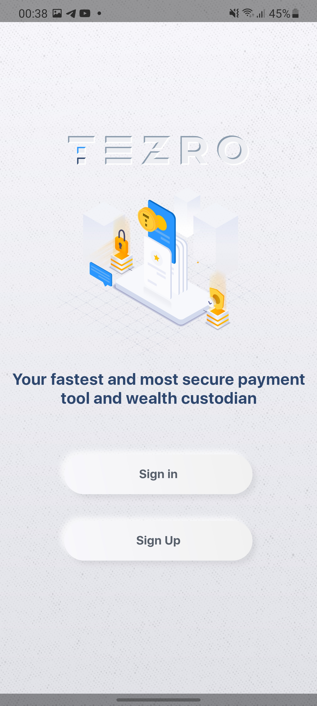
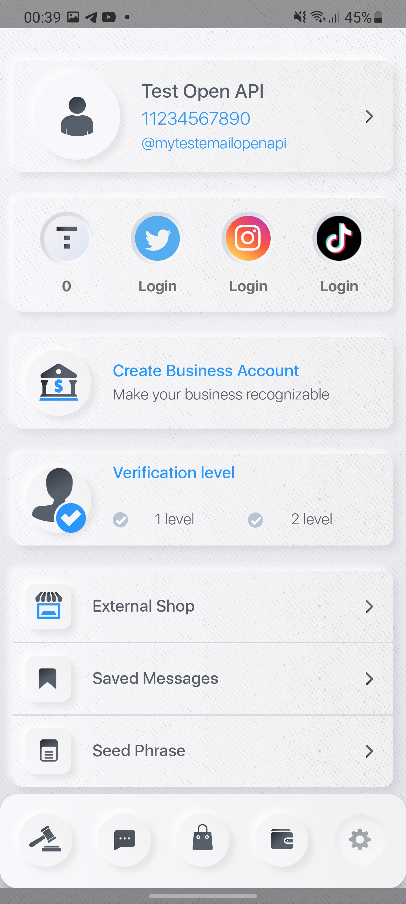
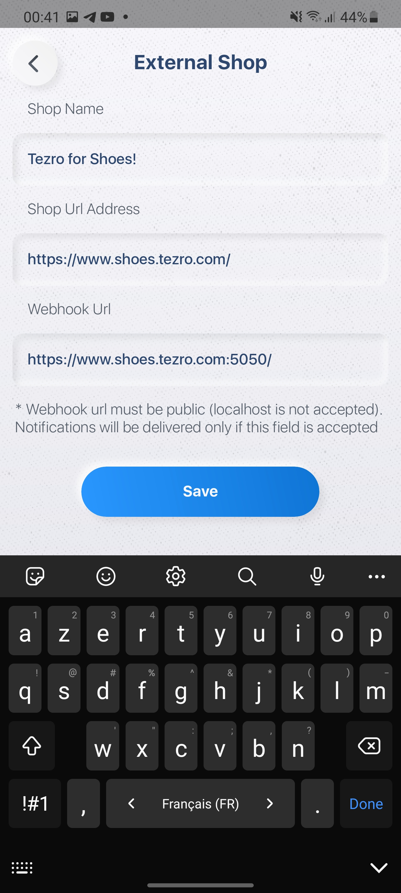
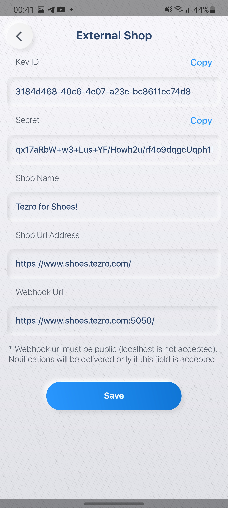

# Registration

To register a new shop, please download [**Tezro**](https://tezro.com/) mobile app or use the web/desktop version. 

## When you open the app you will be asked to sign in:

Create a new account or use your existing one.

## After completing authorization steps, head to the settings tab, then click on **External Shop**:

## This will proceed you to a registration form, enter your shop's data:

## After completing the form, please click save to receive your `KeyId` and `Secret`:

## That's it! You are now ready to use the api!
